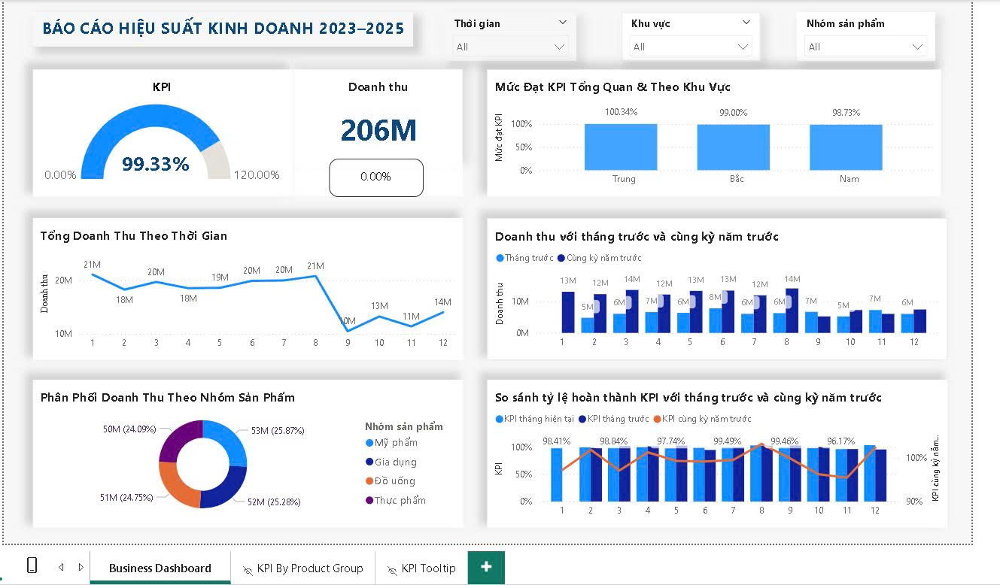

# 📊 Business KPI Dashboard | Power BI Sales Analytics

## 📌 Introduction

This project delivers an interactive **Power BI dashboard** for monitoring and analyzing business **sales performance and KPI achievement** across multiple regions and product groups.  
The dashboard is designed to provide key stakeholders with actionable insights into revenue trends, target achievements, and growth analysis.

## 🏗️ Project Overview



The dashboard includes:
- **Revenue performance** over time (monthly view).  
- **KPI tracking** with achievement percentages.  
- **Growth analysis** compared to previous month and same period last year (MoM & YoY).  
- **Regional & product group segmentation** for detailed insights.  

## 🛠 Tech Stack

- **Visualization**: Power BI (v2.141.x)  
- **Data Source**: Excel (simulated sales data)  
- **ETL/Transformation**: DAX measures in Power BI  
- **Version Control**: Git & GitHub  

## 📂 Dataset

- **Time period**: 01/2023 – Present  
- **Regions**: North, Central, South  
- **Product Groups**: Home Appliances, Beverages, Cosmetics, Pharmaceuticals  
- **Key Metrics**: Revenue, KPI (Target Revenue), Growth (MoM, YoY)

> **Note**: Data is fully simulated and does not reflect real company performance.

## ✨ Features

- **KPI Tracking**: Visual comparison of actual revenue vs. KPI targets.  
- **Growth Analysis**:  
  - Month-over-Month (MoM) revenue growth.  
  - Year-over-Year (YoY) revenue growth for the same period.  
- **Dynamic Filtering**: By region, product group, and time period.  
- **Interactive Dashboard**: Enables stakeholders to explore key business metrics with ease.

## 🔢 Key DAX Measures

- **Total Revenue**  
  ```DAX
  Total Revenue = SUM('Sheet1'[Doanh thu])
  ```

- **Total KPI**  
  ```DAX
  Total KPI = SUM('Sheet1'[KPI])
  ```

- **KPI Achievement %**  
  ```DAX
  KPI Achievement % =
      DIVIDE([Total Revenue], [Total KPI], 0)
  ```

- **Revenue Growth MoM %**  
  ```DAX
  Revenue Growth MoM % =
      DIVIDE([Total Revenue] - [Revenue Previous Month], [Revenue Previous Month], 0)
  ```

- **Revenue Growth YoY %**  
  ```DAX
  Revenue Growth YoY % =
      DIVIDE([Total Revenue] - [Revenue Same Period Last Year], [Revenue Same Period Last Year], 0)
  ```

## 🚀 Future Enhancements

- Integration with a **real-time data source (SQL Server or Azure)**.  
- Automate report refresh using **Power BI Service & Gateway**.  
- Expand KPI dimensions (e.g., Profit, Conversion Rate).  
- Add predictive analytics using **Python/R integration in Power BI**.

## 🎯 Key Learnings

- Building **interactive BI dashboards** for executive-level decision making.  
- Designing **DAX measures** for KPI and growth analysis.  
- Leveraging **GitHub for version control & collaboration** in BI projects.

# 👤 Author

**Nguyen Dinh Hoang Tuan**  
📧 ndhtuan02@gmail.com  
🔗 [LinkedIn](https://www.linkedin.com/in/tuan-nguyen-02353b378) | [GitHub](https://github.com/Devhtuan)
